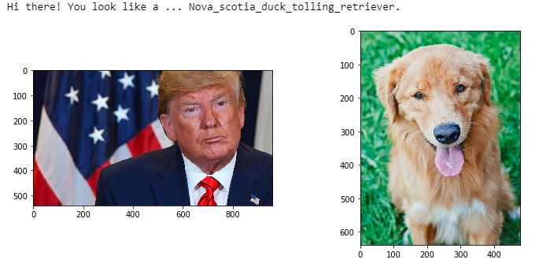
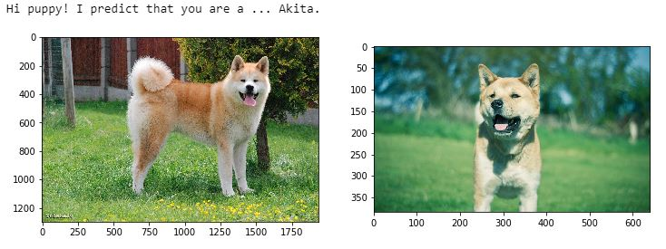

# deep-learning-dog-breed-classification
Core algorithm for application that classifies dog images according to its breed and outputs the most resembling breed when a human image is provided.

Expected outputs:

## Installation

This project requires Python and libraries used in Data Science and Deep Learning such as:
- numpy
- pandas
- matplotlib
- scikit-learn
- keras

To easily check the code at the same time as the output, it is recommended to install Anaconda and Jupyter Notebook.
To speed up training time, it is highly recommended to use GPU.

## Dataset Description

Two datasets are available:

- First dataset contains 8,351 dog images in total, pre-labeled with 133 dog breed names. It is divided into train, evaluation and test set with proportion of 80%, 10% and 10% respectively. Download the [dog dataset](https://s3-us-west-1.amazonaws.com/udacity-aind/dog-project/dogImages.zip). Unzip the folder and place it in the repo, at location `path/to/dog-project/dogImages`. 

An example of dog image:

 

- Second dataset contains 13,233 human images. It will be useful to test human detector function as well as the final algorithm’s. Download the [human dataset](https://s3-us-west-1.amazonaws.com/udacity-aind/dog-project/lfw.zip). Unzip the folder and place it in the repo, at location `path/to/dog-project/lfw`. If you are using a Windows machine, use [7zip](http://www.7-zip.org/) to extract the folder. 

An example of human image:

## Project Motivation

This project aims to create a core algorithm to classify dog images according to their breed, that could be used as part of mobile or web app. The application should provide a fun user experience as it will accept not only dog images but any user-supplied image as input. If a dog is detected, the algorithm should output a prediction of the dog’s breed. If a human is detected, the output should be the most resembling dog breed !
The project allows me to experiment with building a real image classification, to understand the challenes behind the hood and to make decisions about a real-world problem that doesn't have perfect answer.

## Task Description

The main tasks in this project are the following:

#### Project Definition
Explain the project domain, origin. Define the problem that needs to be solved and metrics that will be used to measure performance.

#### Analysis
Explore the dataset to understand it and to define the processing step. Provide statistic visualization about the dataset. Determine the challenges that need to be solved.

#### Methodology
Preprocess the data. Benchmark different classifiers. Try to understand why an architecture works better than other. Fine-tune the model to get higher performance.

#### Results
Report the results from Implementation. Evaluate, test and discuss the results. 

#### Conclusion
Summarize end-to-end problem solution. Propose some improvement ways.

## Result summary
The best model reports approx. 80% of accuracy. It gives expected answer when a non-dog-neither-human image is provided. It performs well on almost dog images, though it fails to work on some 'challenging' dog breed images. The outputs for human images are quite convincing.

The full project report is available in this [repo](report.pdf) and in this [Medium blog post](https://medium.com/@fnguyen/having-fun-learning-cnns-example-of-dog-breed-prediction-applicable-to-human-images-59b0700462b5?sk=2eaf3d30772f33b95c792ff486929779).

## Licensing, Authors, Acknowledgements
The dataset was provided by Udacity as part of its [Data Scientist Nanodegree program](https://www.udacity.com/course/data-scientist-nanodegree--nd025).
A LICENSE file is added in this repo to state clearly its licence.
